# Project Background 
Widgets as Service is an application to create various widgets which can be embedded into other webpages and collect information from user interactions. The application should provide an interface to create new widgets like forms and questionnaire set, Fivestar Widget etc.

Widgets as a service will have 3 applications

1. Forms/stand alone Widget creation tool.
2. Form/stand alone Widget serving to customers.
3. Recording User responses & saving their responses to data-warehouse.

# Requirements
1. Service for creating Forms & Stand alone widgets, where a Form may include multiple widgets in it. 
2. The service should be such that it allows user to edit already created Forms/Widgets, basically he can **Add/Delete/Edit** those Widgets (Stand alone as well as those in Form)
3. Service should be such that the User should be able to publish the Form/Widget once he/she is done creating/editing it. Publishing basically means he/she can generate a unique URL for each Widget/Form which can be embedded into any Webpage or can be served stand alone.
4. Widgets in form can have conditions on it's display & mandatoriness depending upon responses of other widgets of the form.
5. End-user can view the Forms in more than one language (concept of Internationalization)
6. The user response for Forms/Widgets should be validated according to constraints on widgets and finally saved to the Database.

# HLD 
**Product Manager Use-Case** \
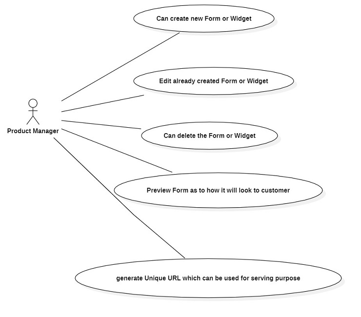 

## Self Service Part
1. We provide a UI to user for creating/deleting/editing Forms & Widgets
2. Since the user can edit the created Form/Widgets , we want a design in which we should be able to persist user's choice.
3. We have a design where we save the preferences of User for particular Form/Widget into the DB & whenever he/she wants to edit it, then based upon the interaction with the UI, we fetch the corresponding item from DB and render it to user using predefined templates, now for each changes he/she makes into the Form we correspondingly update the items in DB & re-render the updated item.
4. Each of the fields in the Forms/Widgets will be driven by **String-ID's** so that we can have the functionality of localzation.
5. The user response consists of String-ID's of the text to be displayed in fields in various types of Widgets.

## Serving Part
1. Since we want a unique URL for each Form/Widget , so we have a unique identifier for each Form/Widget which is a UUID string. It can uniquely identify each Form/Widget created &  can be used to create unique link to serve it to customer.
2. The serving part is again achieved using the predefined templates we have for each type of Widget. So while serving it , we dynamically fetch the Product Managers preferences for a particular Form/Widget , convert them into JAVA Objects & render them using the corresponding templates. The end product is an HTML page containing the Form/Widget to which a customer can respond.

## Saving End-user Response
1. The user should be able to view the form in more than one language.
2. Once the Form/Widget is displayed to the end-user , he/she fills the appropriate response & presses the Submit Button.
3. On the press of Submit button , the response is validated considering the constraints on form (in case of form) & notifies the user if it is incomplete & promts to complete it.
4. Once the response has been validated , it is sent to backend using AJAX & is converted to JAVA Object which is then saved to the DB & a Notification is given to user for the same.

# Approach
So in all these approaches , the only thing that is different is how we model Forms & Widgets entities , rest the whole process which is basically the flow of information between controller classes , service classes , Repository classes remains same. The major focus is to model the entities in a more generic way which is acceptable to future changes.

## Approach 1 [Most BASIC]
1. Model widgets in form differently from single widgets , meaning both these widgets will have different implementations.
2. No inheritance design in widgets of form  & single widgets , which ideally means these classes will have multiple attributes and some will be non-null depending upon the type of widget it is, rest will be null. 
3. Form class will contain a list of widgets. 
4. For Saving end-user Responses to form , have 2 entirely different classes as _WidgetResponse_ && _FormResponse_ for storing response for stand alone widget & form. Responses of Form will have different implementation of _WidgetResponse_ .
5. Similar to Widgets , _WidgetResponse_ will have some attributes as null & other non-null depending upon the type of widget for which the response is noted.
### Pros
The only pros of it is that this approach is very easy to implement for less variety (1~2) of widgets.
### Cons 
1. Too much redundant information kept in widgets classes, like if we want to add fivestar widget & till now we have HMD & Short Answer widget , then this widget object of fivestar type will have its field attributes as not null but rest other attributes of HMD & Short Answer widget will be NULL.
2. Since both form widgets & stand alone widget have differet implementation , means for every new type of widget added , we need to refactor code in 2 classes.
3. Tight coupling between the classes.
4. If one wants to add a new type of widget , then it will require changing a lot of code.
5. The buisness object validation logic will grow exponentially complex as we begin adding new type of widegts.
6. There is no concept of constraints in the Form.
7. Again there will be a lot of redundant indformation in Response Classes. 
## Approach 2 
1. Model widgets in form & Stand alone widgets in one class only i.e **Abstract Widget** , since both are containing similar information.
2. Since Widgets can be of different type & each of them will have some common information , so bring the concept of inheritance into picture.
3. For each new type of widget , we will make a concrete implementation of _Abstract Widget_ , and it will only contain the attributes for itself.
4. Keep all the Auditing information in a seperate class **AuditingInfo** and include its object into the Widgets class, so as to keep the Widgets class minimal.
5. Forms will now contain a list of _Abstract Widget_, and will also have an object of _AudingInfo_.
6. We will also have a **Constraint** class, which will contain the ID of Widget & if it's mandatory or not
7. Forms will contain a list of _Constraint_ , which will contain info regarding the mandatory & optional widget in form. This will be useful in validating clients responses to the form.
8. For end-user responses , since there will a common info like _responseId,userCreated_ for form as well as widget response, hence we abstract that out and create an **AbstractResponse** class. 
9. Further we have an **AbstractWidgetResponse** class which will extend **AbstractResponse** class. Since for each type of Widget, it's response will have common info like _widgetId, _widgetType_  so we extract that into **AbstractWidgetResponse** class.
10. Now for each type of Widget we can have a concrete implementation of **AbstractWidgetResponse** class & it will only have fields for that particular type of response.
11. Form Response will be a concrete implementation of **AbstractResponse** class , also it will have a list of responses for widgets present in the form.
### pros
1. The classes are now decoupled from each other. Adding a new Type of Widget will not require changing the code in other classes now.
2. Business object validation logic will be simplified a lot, each type of widget can have its own implementation of object validation.
3. Client side form response validation can be achieved using that _Constraint_ class.
4. Response classes are now decoupled & there is no more redundant information.
### cons
1. Still need to improve _Constraint_ class for incorporating more complex constraints like dependecy of one widget onto another etc.
## Approach 3 [Preferred]
1. Instead of **Form** class containing a **Constraint** class , we make new 2 new classes for constraints.
2. In this approach each new Widget will have a set of constrainsts on it (can be none also). We remove the previous **Constraint** class.
3. New **WidgetConstraint** class will have _widgetId_ & _responseId_ fields , where the combination depicts the widget & ID of various type of that widget's responses.
4. New **WidgetConstraintCollection** will contain multiple lists of type **WidgetConstraint**, each list depicting a type of constraint imposed on the widget containing the object of **WidgetConstraintCollection** class.
5. This list is basically the set of widget ID's & whose responses will constraint the mandatoriness or display or both properties for the, widget containing the object of **WidgetConstraintCollection**
6. The form's response will only be submitted when the user meets all the constraint defined for each widget of that form.
### pros
1. In this way each widget can have it's own set of constraints. This will allow us to model more complex dependency of widgets on one another like , showing a widget when  some other particular widget/widgets are answered OR making a widget mandatory or optional depending upon the responses of some other particular widgets OR both
2. Later on if use case comes for new set of constraint then they can be modelled easily by adding or removing the lists in **WidgetConstraintCollection** class , no additions will be required on **AbstractWidget** concrete implementation classes.
3. Later on if we want to add constraints to form , like answer minimum 2 widget etc then those can be directly added to **Form** class

# LLD
**Class Diagram** \
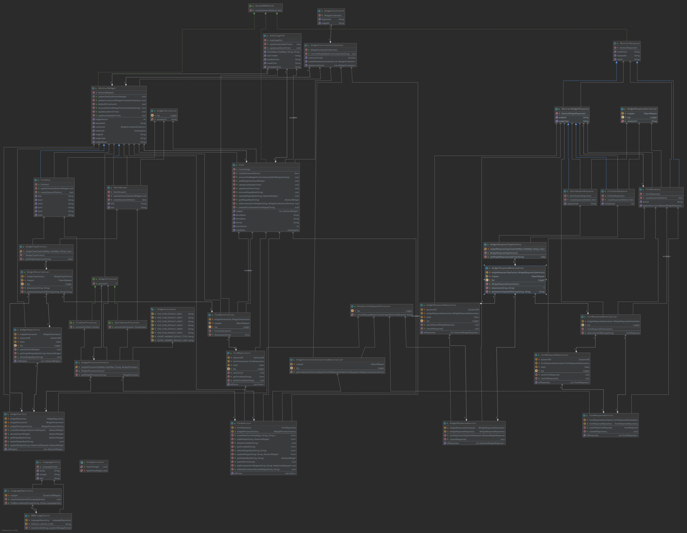 

## Widget 
We already have the design for entities in our **Approach** section. 
Now For each new type of Widget we can have a concrete implementation of this **AbstarctWidget** class which will only contain the fields which can be customized for that specific type of Widget. Further each concrete class can have its own implementation of methods to update Widget, create DB object etc. Here we have 2 concrete implementation namely the **FiveStarWidget** & **ShortAnswerWidget**. \
AbstractWidget class will have an object of **WidgetConstraintCollection** which will contain set of constraints

## Form
A **Form** has information like _ID,Name,Version,Status,metaData,widgets,constraints_. \
 _widgets_ attribute is a list of **Widget** which are present inside the Form and is of type ***_AbstractWidget_*** \
 Form class have their own implementation of methods to create DB object.

## Response
### Widget Response
There are multiple concrete implementation for **AbstractWidgetResponse** class & each has it's own set of Attributes & have their own custom implementation of method for creating a DB object. 
### Form Response
**FormResponse** class has list of **AbstractWidgetResponse** which contain the concrete Response Objects for Widgets Response. It also has its own implementation of method for creating a DB object

## Service Classes
1.These are the classes for core business logic of our project. These methods in these classes are invoked by controller classes. We have seperate Service classes for each of Form , Widget, WidgetResponse, FormResponse. \
2. The methods handles the process from deserializing the incoming HttpRequest to objects , to then processing these deserialized object and calling Repositories methods for persisting these objects in DB, calling the Repositories to perform CRUD operations in DB.

### Widget Service
1. It has all the methods that one can perform on Widget entity , right from creating a new one, editing, deleting a stand alone widget, fetching/saving a particular widget from/to the DB.
2. It has instance of **WidgetDeserializer** which is used to deserialize the JSONString of Widgets into the corresponding DTO.
3. **HttpServletRequestProcessor** class static method is used to process the body of incoming HTTPServlet Request & convert into JSON String, which is then used by Form & Widget deserializers to deserialize into DTO.
4. It also has an instance of **WidgetRepository** which is used to perform CRUD operations in Widget table in DB.

### Form Service
1. It has all the methods that one can perform on a Form entity, right from creating a form, edit a form , delete a form, add-remove-delete widgets in form.
2. **WidgetProcessorFactory** is factory class which return the Widgetprocessor depending upon the type of widget & has corresponding method to process that widget. \
   (By Processing a widget we mean , filling in the default values in fields if user has not provided his response for that field)
3. It also has instance of **FormRespository**  which is Respository class used to perform CRUD operations in 'Form' table in DB.
4. It also has methods to add & remove constrainsts from the widgets present in the Form.

### Widget Response Service
1. We have method to insert the Response of Widget into 'widgetResponse' table , & method to fetch all the responses for Widgets which are there in DB.
2. It has instance of **WidgetResponseDeserializer** which is used to convert JSONString into java object of subclasses of _AbstractWidgetResponse_ class.
3. It also has instance of **WidgetResponseRespository** which is used to Persist the DTO to 'widgetResponse' table in DB.

### Form Response Service
1. We have  method to insert the Response of Form into 'formResponse' table & method to fetch all the form responses which are there in DB.
2. It has instance of **FormResponseDeserializer** which is used to convert JSONString into DTO objects of type  _FormResponse_.
3. It also has instance of **FormResponseRespository** which is used to Persist the DTO to formResponse table in DB.

## Helper Classes
### Deserializer & Serializer classes
1. These are the classes with custom methods for deserializing the JSONStrings into the corresponding DTO & serializing DTO back to JSONStrings for persisting in DB.
2. We have **WidgetDeserializer** & **WidgetSerializer** for Widgets 
3. **FormDeserializer** for Forms 
4. **WidgetConstraintCollectionDeserializer** for WidgetConstraintCollection strings.
5. **WidgetResponseSerializer** & **WidgetResponseDeserializer** for Widget Response.
6. **Form Response Deserializer** for Form Response.
### Request Processor Class
**HttpServletRequestProcessor** class has static method to extract the body of incoming HttpServlet Request & convert to string.
### Factory Classes
1. We have **WidgetTypeFactory** class which maps the String containing "widgetType" to concrete subclass of **AbstractWidget**. It is used to know at runtime about the type of Widgets which the **WidgetDeserializer** should deserialize an JSON String into . 
2. We have **WidgetProcessorFactory** class which provides the Interface given a String containing "widgetType", for processing a widget. The interface is used at runtime to Process objects of subclasses of **AbstractWidget**. Each type of inetrface can have it's own implementation of process() method. 
3. We have **WidgetResponseTypeFactory** class which maps the String containing "widgetType" to concrete subclass of  **AbstractWidgetResponse**. It is used at runtime to know about the type of widgetResposne which the **WidgetResponseDeserializer** class should deserialize an JSON String into.
### Resource
1. **DBMessageSource** class has method for getting the text given a locale & StringId params. It calls the method in **LanguageRepository** to do so.

## Repository Classes
We have  5 repository classes namely 
1. **WidgetRepository** : has the methods to perform CRUD operations on 'widget' table. 
2. **FormRepository** : has methods to perform CRUD operations on 'form' table. 
3. **WidgetResponseRepository** : has methods to perform CRUD operations on 'widgetResponse' table. 
4. **FormResponseRepository** : has methods to perform CRUD operations on 'formResponse' table. 
5. **LangaugeRepository** : has method to perform create & Read operations on 'language' table.

## Localization Features
For incorporating the Localization feature , that is serving in more than one Language.We use CookieResolver. We achieve it via storing the locale & Stirng-Id's in the DB in 'language' table. So for that We have a **LanguageEntity** class storing the _locale_,_stringId_ & _text_ for a partcular stringId & locale [locale is language code basically]. \

## ER Diagram
These are the tables in DynamoDB , this is how data is stored in DynamoDb. \
**ER-Diagram**  \
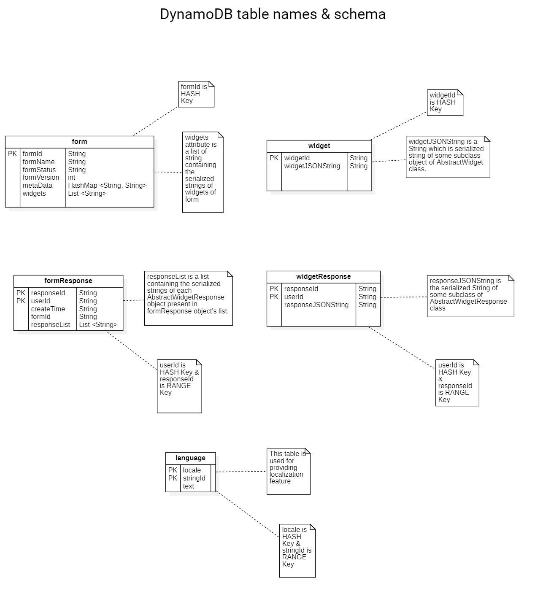 

## Sequence Diagrams
**Main Page Interactions** \
Below is the flow of information for all the intearctions on Main-Page. \
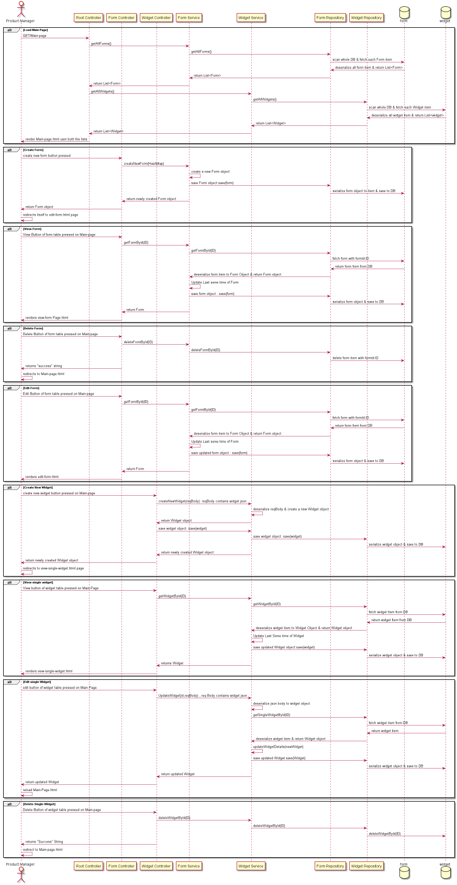 

**Edit Form Page Interactions** \
Below is the flow of information for all the interactions on Edit-Form Page  \
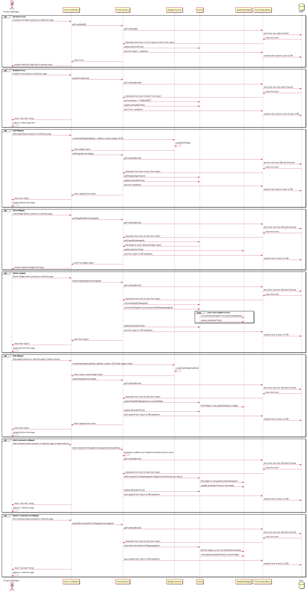 

**Collecting User Responses Interactions** \
Below is the flow of information for all the interactions while getting user-responses \ 
 

# Results
## Main page
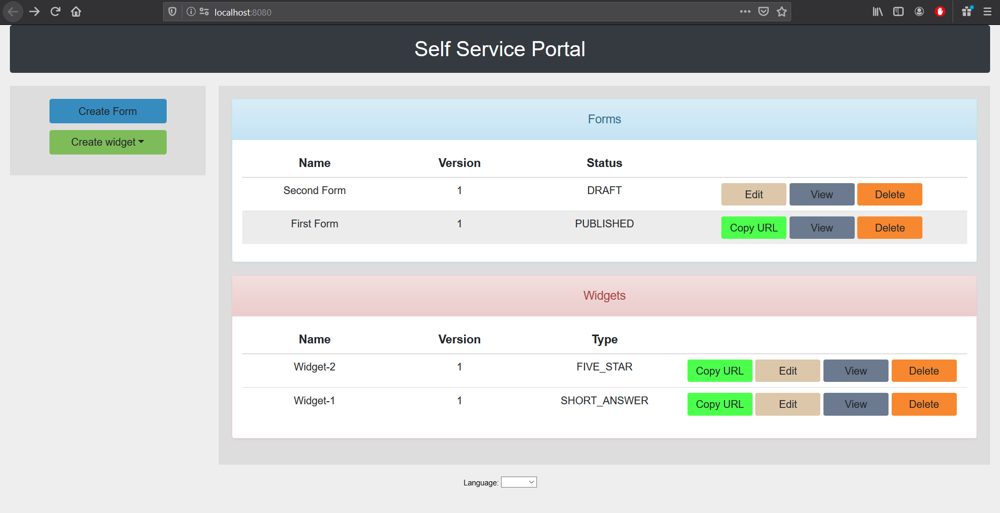
## Edit Form Page
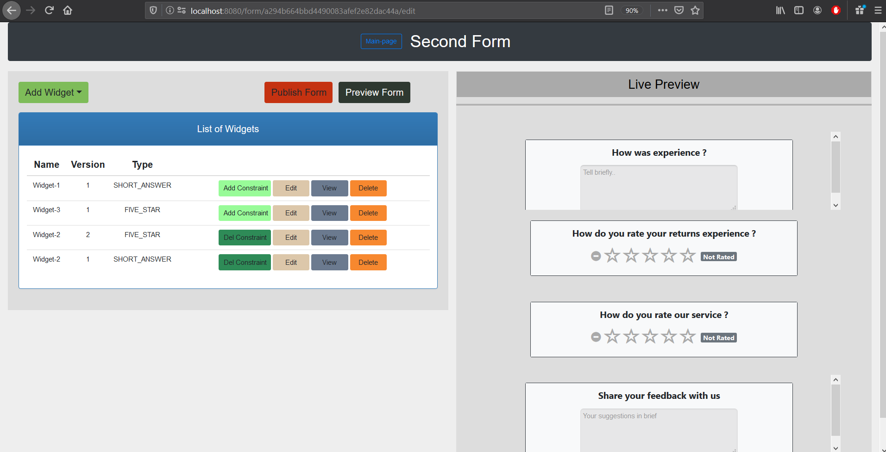
## Form Display to customer
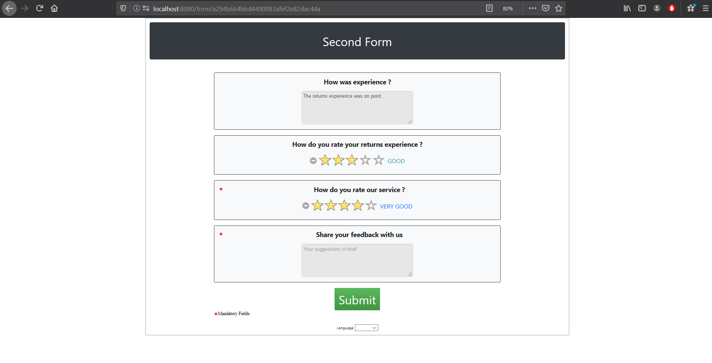
## Form Display to customer in Hindi
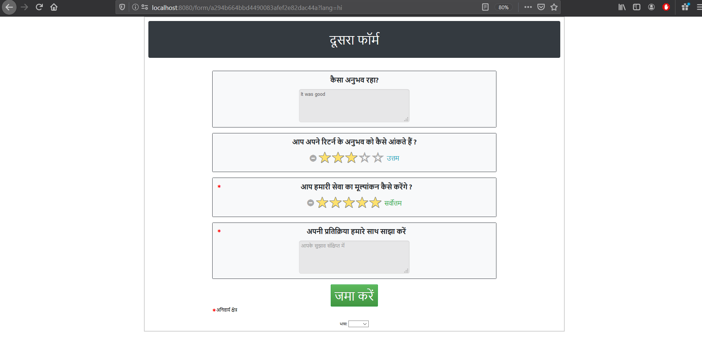
## Widget Response noted from customer
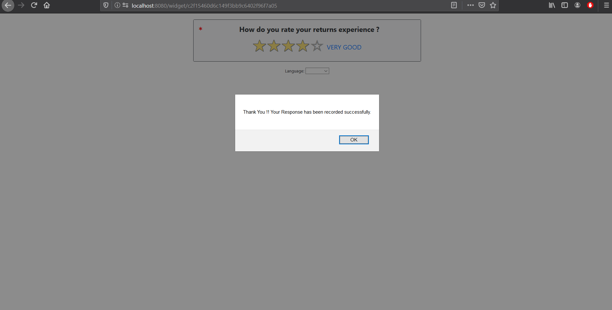
## Stand alone Widget served to customer
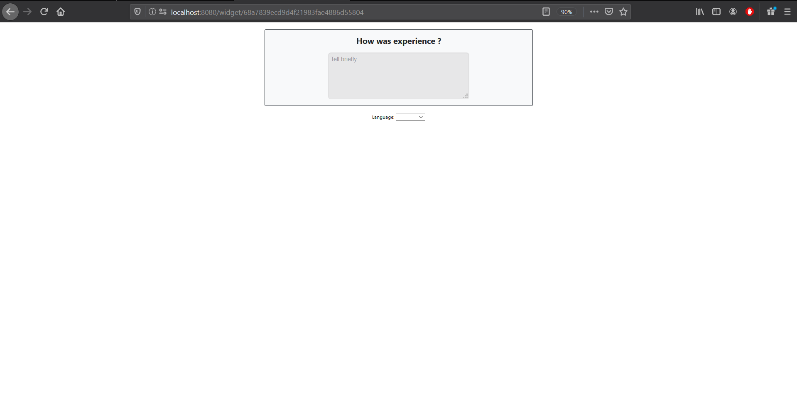
## How Form Response saved in DB ?
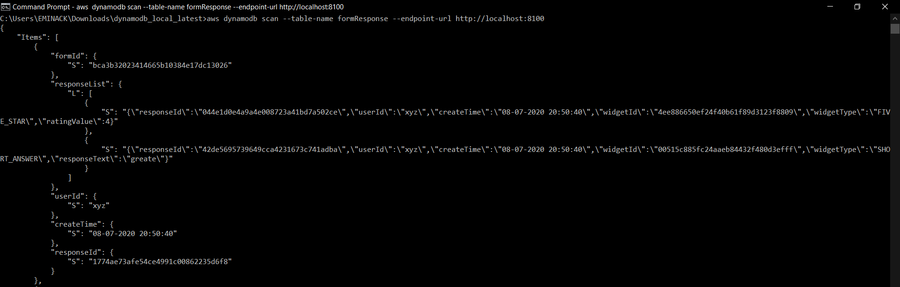
## How Widgets Response saved in DB ?
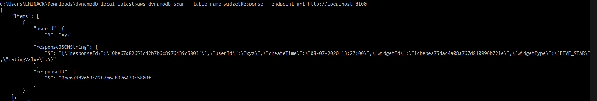

  

